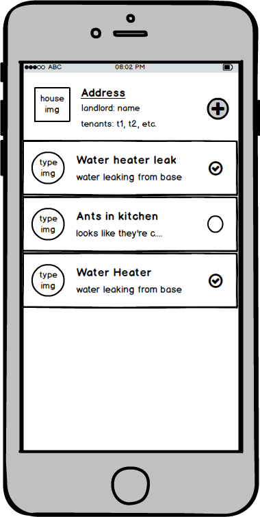
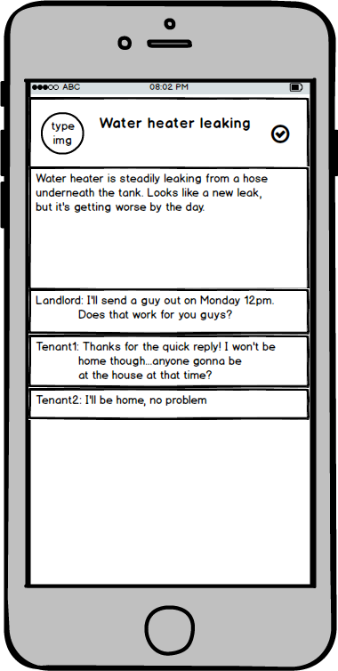

## Dwel

### Background

Communication between landlord and tenant can stressful and hard to keep records of. Dwel is a mobile app that connects landlords and tenants through a simple UI that allows tenants to create repair tickets for landlords and keeps a record of all relevant communications.

The tenant can add a repair ticket by providing a title and description of the issue. Each task has a comments section where landlord and tenants can chat about the details. After a task has been completed, it gets checked off by the landlord but stays in the property profile. Tasks and their communication records are never removed.

### Functionality & MVP

With this app, users will be able to:

- [ ] login / Signup using email
- [ ] Tenants can create repair tickets
- [ ] Tenants and landlords can communicate on threads attached to tickets
- [ ] Landlords can mark tickets as "done"

Bonus features:

- [ ] Venmo payments using Venmo API (tenants and landlords)
- [ ] Tenants can add photos of repair to tickets
- [ ] Login using Facebook

### Wireframes

### Technologies & Technical Challenges

This app will be implemented using the following technology: React Native,
JavaScript, HTML and CSS.

Technical challenges will include creating a unique key for users to share with
tenants and landlords they want to group with and learning React Native.

### Group Members & Work Breakdown

Our group consists of three members, Matt McGregor, Victor Guillen and Aron Cutler.  

Matt's primary responsibilities will be:

- Setting up back-end and front-end user authentication.
- Designing backend architecture to differentiate between landlord and tenant users.
- Creating sign up and login form component for landlords and tenants
- Creating the display page & marketing the app
- Writing the authentication aspects of repo's README, complete with screenshots and code snippets  

Victor's primary responsibilities will be:

- Setting up back-end messaging functionality.
- Building message index, index item, and form components.  
- Styling all message components.  
- Writing the messaging aspects of the repo's README, complete with screenshots and code snippets
- Creating the display page & marketing the app

Aron's primary responsibilities will be:

- Setting up backend to-do functionality.  
- Building ticket index, index item, and form components.  
- Styling all ticket components.  
- Writing the ticket aspects of the repo's README, complete with screenshots and code snippets
- Creating the display page & marketing the app

### Implementation Timeline

**Day 1**:
- Get familiar with Google API and React Native (all)
- Begin auth and backend setup with user, message, ticket and property tables (Matt)
- Read Venmo's API documentation. Complete tutorial on sending money. (Victor)
- Build rails backend for tickets, including migrations, model, controller, and JBuilder views (Aron)

**Day 2**:
-  Auth forms for user type (tenants vs landlords) and create SecureRandom code for landlords
   to share with tenants (Matt)
- Create Schema, Model, Routes, Controller, Jbuilder View and AJAX Util for Comments. (Victor)
- Learn React Native and construct tickets api util functions, actions, reducer, and container(Aron)

**Day 3**:
-  Finish Auth and work on form emails sent to tenants by landlord via signup page(Matt)
- Create Actions, Reducer, Container and Presentational component for Comments (Victor)
- Build ticketsIndex, ticketsIndexitem, and ticketsForm components (Aron)

**Day 4**:
-  Work on styling of auth forms (Matt)
- Integrate Venmo API (Victor)
- Style all ticket components all collaborate with Victor and Matt on splash page and session form styling (Aron)

**Day 5**:
- assist on any loose ends and work on production readme / marketing (Matt)
- Style App (Victor)
- Integrate tickets into history page and write tickets portion of Production README (Aron)

### Plan for getting users and reviews
- links to app page will be posted on relevant subreddits and message boards
- All members will share app with landlords and tenants
- App will be submitted to the Apple App Store  
